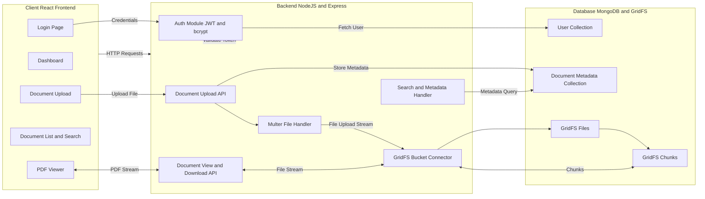

```mermaid
flowchart LR

    %% ===== CLIENT LAYER ===== %%
    subgraph CLIENT ["Client React Frontend"]
        C1[Login Page]
        C2[Dashboard]
        C3[Document Upload]
        C4[Document List and Search]
        C5[PDF Viewer]
    end

    %% ===== BACKEND LAYER ===== %%
    subgraph BACKEND ["Backend NodeJS and Express"]
        B1[Auth Module JWT and bcrypt]
        B2[Document Upload API]
        B3[Document View and Download API]
        B4[Search and Metadata Handler]
        B5[Multer File Handler]
        B6[GridFS Bucket Connector]
    end

    %% ===== DATABASE LAYER ===== %%
    subgraph DATABASE ["Database MongoDB and GridFS"]
        D1[User Collection]
        D2[Document Metadata Collection]
        D3[GridFS Files]
        D4[GridFS Chunks]
    end

    %% === FLOWS === %%
    CLIENT -->|HTTP Requests| BACKEND
    BACKEND -->|Validate Token| B1

    C3 -->|Upload File| B2 --> B5 -->|File Upload Stream| B6 --> D3
    D3 --> D4

    B2 -->|Store Metadata| D2
    B4 -->|Metadata Query| D2

    C5 <-->|PDF Stream| B3 <-->|File Stream| B6 <-->|Chunks| D4

    C1 -->|Credentials| B1 -->|Fetch User| D1
```
